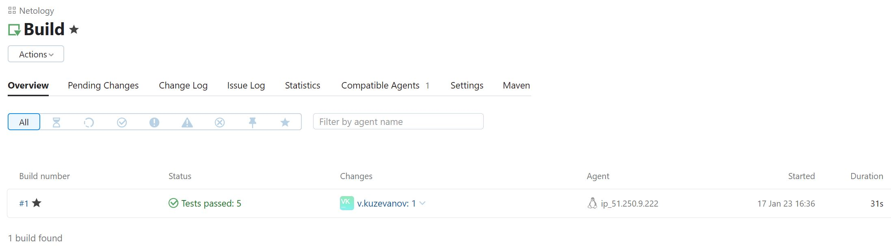
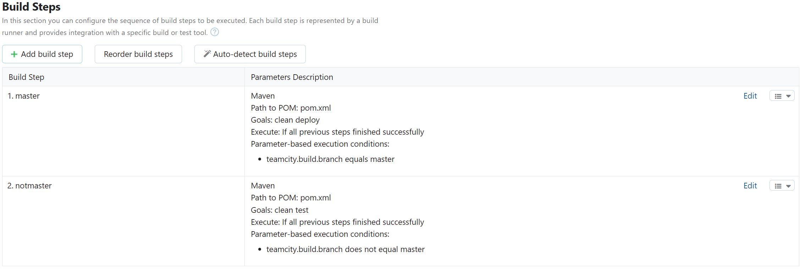
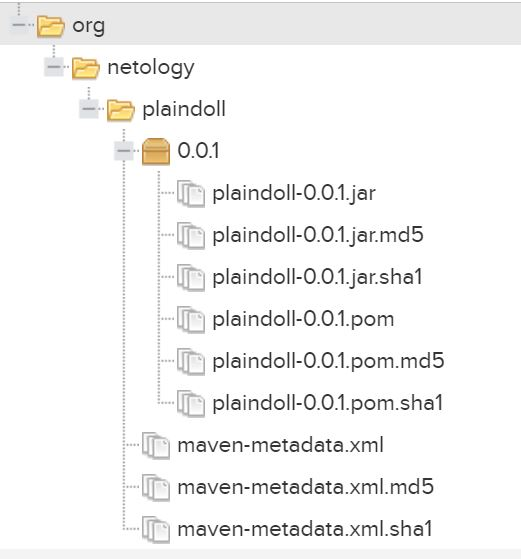
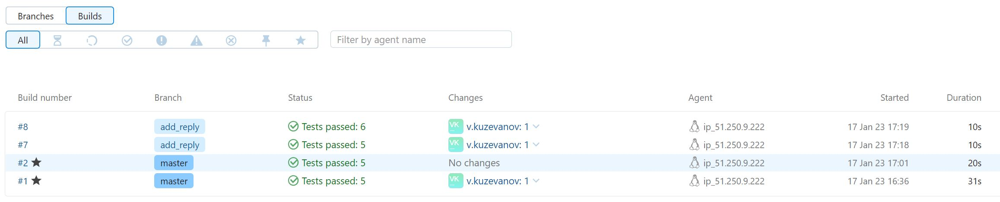

# devops-DZ9.5-Teamcity
# Домашнее задание к занятию "11.Teamcity"

## Подготовка к выполнению

1. В Ya.Cloud создайте новый инстанс (4CPU4RAM) на основе образа `jetbrains/teamcity-server`
2. Дождитесь запуска teamcity, выполните первоначальную настройку
3. Создайте ещё один инстанс(2CPU4RAM) на основе образа `jetbrains/teamcity-agent`. Пропишите к нему переменную окружения `SERVER_URL: "http://<teamcity_url>:8111"`
4. Авторизуйте агент
5. Сделайте fork [репозитория](https://github.com/aragastmatb/example-teamcity)
6. Создать VM (2CPU4RAM) и запустить [playbook](./infrastructure)

## Основная часть

1. Создайте новый проект в teamcity на основе fork
2. Сделайте autodetect конфигурации
3. Сохраните необходимые шаги, запустите первую сборку master'a
4. Поменяйте условия сборки: если сборка по ветке `master`, то должен происходит `mvn clean deploy`, иначе `mvn clean test`
5. Для deploy будет необходимо загрузить [settings.xml](./teamcity/settings.xml) в набор конфигураций maven у teamcity, предварительно записав туда креды для подключения к nexus
6. В pom.xml необходимо поменять ссылки на репозиторий и nexus
7. Запустите сборку по master, убедитесь что всё прошло успешно, артефакт появился в nexus
8. Мигрируйте `build configuration` в репозиторий
9. Создайте отдельную ветку `feature/add_reply` в репозитории
10. Напишите новый метод для класса Welcomer: метод должен возвращать произвольную реплику, содержащую слово `hunter`
11. Дополните тест для нового метода на поиск слова `hunter` в новой реплике
12. Сделайте push всех изменений в новую ветку в репозиторий
13. Убедитесь что сборка самостоятельно запустилась, тесты прошли успешно
14. Внесите изменения из произвольной ветки `feature/add_reply` в `master` через `Merge`
15. Убедитесь, что нет собранного артефакта в сборке по ветке `master`
16. Настройте конфигурацию так, чтобы она собирала `.jar` в артефакты сборки
17. Проведите повторную сборку мастера, убедитесь, что сбора прошла успешно и артефакты собраны
18. Проверьте, что конфигурация в репозитории содержит все настройки конфигурации из teamcity
19. В ответ предоставьте ссылку на репозиторий

---


## Решение

- Создаём ВМ `Teamcity Server` в Яндекс Облаке
    - образ jetbrains/teamcity-server
    - teamcity-server: 158.160.47.237
- Создаём ВМ  `Teamcity Agent` в Яндекс Облаке
    - образ jetbrains/teamcity-agent
    - Укажем переменную окружения `SERVER_URL: http://158.160.47.237:8111`
    - teamcity-agent: 51.250.9.222
- Создаём ВМ `Nexus` в Яндекс Облаке
    - nexus: 158.160.50.246
- Пропишем в файле `infrastructure/inventory/cicd/hosts.yml` адрес машины nexus и пользователя ansible
    ```
    ansible_host: 158.160.47.237
    ansible_user: vk77
    ``` 
- Запустим проигрывание в Ansible  
    - `ansible-playbook -i inventory/cicd/hosts.yml site.yml`
```bash
    root@vkvm:/home/vk/netology/mnt-homeworks/09-ci-05-teamcity/infrastructure# 
[WARNING]: You are running the development version of Ansible. You should only run Ansible from "devel" if you are modifying the Ansible engine, or trying out features under development. This is a rapidly changing source of
code and can become unstable at any point.

PLAY [Get Nexus installed] *********************************************************************************************************************************************************************************************************

TASK [Gathering Facts] *************************************************************************************************************************************************************************************************************
The authenticity of host '158.160.50.246 (158.160.50.246)' can't be established.
ED25519 key fingerprint is SHA256:TPunrzYnYrN0S5XcKA0CoyFASvTJPml5i1lyoUJ1/EM.
This key is not known by any other names
Are you sure you want to continue connecting (yes/no/[fingerprint])? yes
ok: [nexus-01]

TASK [Create Nexus group] **********************************************************************************************************************************************************************************************************
changed: [nexus-01]

TASK [Create Nexus user] ***********************************************************************************************************************************************************************************************************
changed: [nexus-01]

TASK [Install JDK] *****************************************************************************************************************************************************************************************************************
changed: [nexus-01]

TASK [Create Nexus directories] ****************************************************************************************************************************************************************************************************
changed: [nexus-01] => (item=/home/nexus/log)
changed: [nexus-01] => (item=/home/nexus/sonatype-work/nexus3)
changed: [nexus-01] => (item=/home/nexus/sonatype-work/nexus3/etc)
changed: [nexus-01] => (item=/home/nexus/pkg)
changed: [nexus-01] => (item=/home/nexus/tmp)

TASK [Download Nexus] **************************************************************************************************************************************************************************************************************
[WARNING]: Module remote_tmp /home/nexus/.ansible/tmp did not exist and was created with a mode of 0700, this may cause issues when running as another user. To avoid this, create the remote_tmp dir with the correct permissions
manually
changed: [nexus-01]

TASK [Unpack Nexus] ****************************************************************************************************************************************************************************************************************
changed: [nexus-01]

TASK [Link to Nexus Directory] *****************************************************************************************************************************************************************************************************
changed: [nexus-01]

TASK [Add NEXUS_HOME for Nexus user] ***********************************************************************************************************************************************************************************************
changed: [nexus-01]

TASK [Add run_as_user to Nexus.rc] *************************************************************************************************************************************************************************************************
changed: [nexus-01]

TASK [Raise nofile limit for Nexus user] *******************************************************************************************************************************************************************************************
changed: [nexus-01]

TASK [Create Nexus service for SystemD] ********************************************************************************************************************************************************************************************
changed: [nexus-01]

TASK [Ensure Nexus service is enabled for SystemD] *********************************************************************************************************************************************************************************
changed: [nexus-01]

TASK [Create Nexus vmoptions] ******************************************************************************************************************************************************************************************************
changed: [nexus-01]

TASK [Create Nexus properties] *****************************************************************************************************************************************************************************************************
changed: [nexus-01]

TASK [Lower Nexus disk space threshold] ********************************************************************************************************************************************************************************************
skipping: [nexus-01]

TASK [Start Nexus service if enabled] **********************************************************************************************************************************************************************************************
changed: [nexus-01]

TASK [Ensure Nexus service is restarted] *******************************************************************************************************************************************************************************************
skipping: [nexus-01]

TASK [Wait for Nexus port if started] **********************************************************************************************************************************************************************************************
ok: [nexus-01]

PLAY RECAP *************************************************************************************************************************************************************************************************************************
nexus-01                   : ok=17   changed=15   unreachable=0    failed=0    skipped=2    rescued=0    ignored=0   

```

- Первичная настройка Teamcity Server `http://158.160.47.237:8111`
    - Создаём пользователя admin / admin
    - Использовать внутреннюю базу данных
    - Создаем проект Create project / Manually , Name: Netology 
    - В панели Teamcity Server выберем Agents / Unauthorized выберем агента nexus-agent и нажмём Authorize
- Создадим форк репозитория [example-teamcity](https://github.com/aragastmatb/example-teamcity)
    - [Адрес форка](https://github.com/VovetZ/example-teamcity)
- Создадим конфигурацию build в Teamcity
    - В панели управления Teamcity Server выберем созданный проект Netology
    - В настройках проекта выберем New build configuration / From repository
        - Repository URL: `https://github.com/VovetZ/example-teamcity`
        - Username: `VovetZ`
        - Token: публичный ключ
    - После завершения сканирования репозитория выберем Build step: `Maven`
    - Save
- В форке репозитория изменим адрес nexus
    - Отредактируем файл [pom.xml](pom.xml)
        ```
        <url>http://158.160.50.246:8081/repository/maven-releases</url>
        ```
- Проверим сборку в Teamcity
    - В Teamcity Server в настройках проекта Go to build configuration
    - Run
    
- Изменим настройки сборок в 
    - В панели управления Teamcity Server / Projects / Netology / Build / Edit configuration / Build Steps
    - Сделаем два шага со следующими условиями
    - Edit / Add condition
        - teamcity.build.branch equals master
            - Goals: clean deploy
        - teamcity.build.branch does not equal master
            - Goals: clean test

    
- Настроим подключения Teamcity к Nexus
    - В `settings.xml` укажем 
        - `<password>admin123</password>`
    - Загрузим отредактированный файл settings.xml в Teamcity Server / Projects / Netology / Maven Settings / Upload settings file
    - В панели управления Teamcity Server / Projects / Netology / Build / Edit configuration /  Build Steps / Maven deploy
    - В User settings selection выберем settings.xml
- Запустим новую сборку в Teamcity
    - Teamcity Server / Projects / netology / Build / Run
    - После окончания сборки проверим артефакты в Nexus
        - В панели управления Nexus зайдём в Browse / maven-releases
            
- Сохраним настройки проекта Teamcity в репозитории
    - Идем в Teamcity Server / Projects / Netology / Edit Project / Versioned Settings
    - Synchronization enabled
- Создадим ветку add_reply в форке репозитория
- - Создадим ветку add_reply в форке репозитория
- Сделаем изменения в новой ветке
    - src/main/java/plaindoll/HelloPlayer.java
        ```java
            System.out.println(welcomer.sayNewText());
        ```
    - src/main/java/plaindoll/Welcomer.java
        ```java
        public String sayNewText(){
            return "This is a new text in branch, hunter.";
        }
        ```
    - src/test/java/plaindoll/WelcomerTest.java
        ```java
        @Test
        public void welcomerSaysNewText(){
            assertThat(welcomer.sayNewText(), containsString("text"));
        }
        ```
- Проверим что Teamcity провёл тесты
    - В панели управления Teamcity Server / Projects / netology / Build 
        
- Изменим версию приложения в новой ветке форка репозитория в `pom.xml`
       ```xml
        <version>0.0.99</version>
        ```
- Создадим запрос на внедрение изменений в ветку master в репозитории
- Настроим конфигурацию сборки в Teamcity
    - В панели управления Teamcity Server / Projects / Netology / Build / Edit configuration / General settings
    - Укажем в Artifact paths: `target/*.jar => target`
- Запустим сборку проекта в Teamcity
- Проверим наличие артефактов
    - Nexus
        

[Форк репозитория example-teamcity](https://github.com/VovetZ/example-teamcity)
